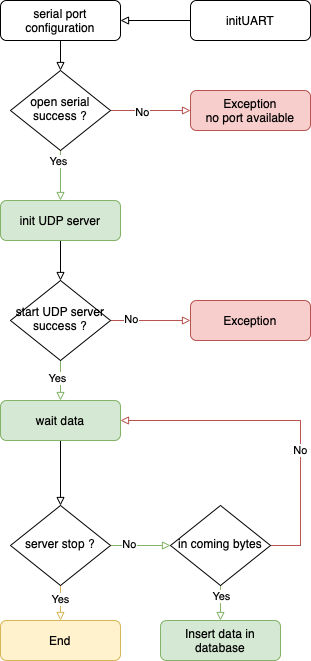
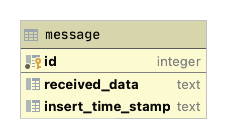
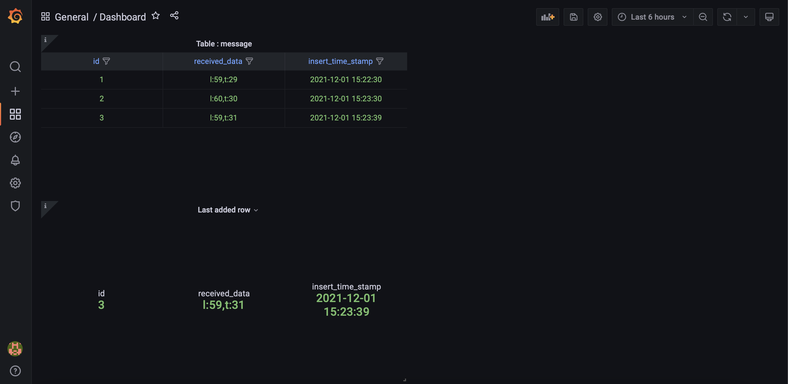

# Serveur python (passerelle) - Equipe 16

# Introduction

Le code est fonctionnel et commenté. Attention, il a été adapté en fonction de la machine qui l'exécute → avec le port serial notamment.

Le code est adapté pour **`python3`** :
```bash
python3 server.py
```

Il a fallu installé **`pyserial`** :
```bash
pip3 install pyserial
```

Nous n'avons pas suivi d'architecture spéciale pour ce projet, nous avons simplement adapté le code existant en fonction de notre architecture IoT.

# Architecture

## Déroulement



## Conception (adaptation du code)

### Variables

```python
'''
 * variables for script
'''
HOST            = "0.0.0.0"
UDP_PORT        = 10000
MICRO_COMMANDS  = ["TL" , "LT"]
FILENAME        = "values.txt"
LAST_VALUE      = "deadbeef"
SERIALPORT      = "/dev/tty.usbmodem14102"
BAUDRATE        = 115200
ENCRYPT         = 3
```

Description des variables :

- `HOST           = "0.0.0.0"` → Toute connexion entrante sur le serveur est acceptée
- `SERIALPORT     = "/dev/tty.usbmodem14102"` → indique le port serial sur lequel le microcontrôleur est connecté. `/dev/tty.usbmodem14102` correspond au deuxième port d'un MacBook Pro de 2019*
- `ENCRYPT           = 3` → Clé de cryptage et de décryptage

### Cryptage

```python
'''
 * function that encrypts the sent data
'''
def encrypt(msg, shiftPattern):
    res = ""
    for i in range(len(msg)):
        res += chr(ord(msg[i]) + shiftPattern)
    return res

'''
 * function that encrypts the received data
'''
def decrypt(msg, shiftPattern):
    res = ""
    for i in range(len(msg)):
        res += chr(ord(msg[i]) - shiftPattern)
    return res
```

Nous avons ajouté le même système de cryptage que dans l'application Android, ce cryptage est utilisé pour :

- Crypter les données envoyées à l'application android
    
    ```python
    last_value = query_select_one_executor("SELECT received_data FROM message ORDER BY id DESC LIMIT 1")
    socket.sendto(encrypt(last_value, ENCRYPT).encode(), self.client_address)
    ```
    
- Décrypter les données reçues par l'application android
    
    ```python
    if decrypt(data.decode(), ENCRYPT) in MICRO_COMMANDS:                         # Send message through UART
	    sendUARTMessage(decrypt(data.decode(), ENCRYPT).encode())
    elif decrypt(data.decode("UTF-8"), ENCRYPT) == "getValues()":                 # Sent last value received from micro-controller
	    last_value = query_select_one_executor("SELECT received_data FROM message ORDER BY id DESC LIMIT 1")
	    socket.sendto(encrypt(last_value, ENCRYPT).encode(), self.client_address)
    ```
    

### Requêtes UDP

```python
class ThreadedUDPRequestHandler(socketserver.BaseRequestHandler):
	def handle(self):
		data = self.request[0].strip()
		socket = self.request[1]
		current_thread = threading.current_thread()
		print(f"{current_thread.name}: client: {self.client_address}, wrote: {decrypt(data.decode(), ENCRYPT)}")
		if data != "":
			if decrypt(data.decode(), ENCRYPT) in MICRO_COMMANDS:                         # Send message through UART
				sendUARTMessage(decrypt(data.decode(), ENCRYPT).encode())
			elif decrypt(data.decode("UTF-8"), ENCRYPT) == "getValues()":                 # Sent last value received from micro-controller
				last_value = query_select_one_executor("SELECT received_data FROM message ORDER BY id DESC LIMIT 1")
				socket.sendto(encrypt(last_value, ENCRYPT).encode(), self.client_address)
			else:                                                                         # Check errors 
				print(f"Unknown message: {decrypt(data.decode(), ENCRYPT)}")
```

Concernant la classe qui va détecter les requêtes UDP en direction du serveur :

- Nous avons ajouté la fonction **`decode`** à la variable data, pour pouvoir comparer des **`string avec des string`** et non **`des bytes avec des string`**
    
    → cette partie du code permet d'envoyer des données en serial au microcontrôleur connecté à la machine qui héberge le serveur.
    
    ```python
    '''
     * send message to microcontroller with serial
    '''
    def sendUARTMessage(msg):
        ser.write(msg)
        print(f"Message <{msg.decode()}> sent to micro-controller") # Display in controle
    ```
    
- L'envoie des données avec **`encode`** permettant à l'application android de recevoir les données en bytes

*Note : les données reçues en bytes sur le serveur sont stockées dans la variable **`data`***

### Gestion de la base de données

```python
'''
 * database connection function
'''
def db_connect(sqlite_path):
    try:
        db = sqlite3.connect(sqlite_path)
        print(f"Base de données connecté {sqlite_path}")
        return db
    except sqlite3.Error as error:
        print(f"Erreur : {error}")

'''
 * database query insert executor function
'''
def query_insert_executor(query):
    try:
        db = db_connect("/Users/alexis/iot.db")
        cursor = db.cursor()
        cursor.execute(query)
        db.commit()
        print(f"Record inserted successfully -> added row : {cursor.rowcount}")
        cursor.close()
    except (sqlite3.Error, KeyboardInterrupt, SystemExit) as errors:
        print(f"Failed to insert data into sqlite table {errors}")
        cursor.close()
    finally:
        if db:
            db.close()
            print("The SQLite connection is closed")
```

- **`db_connect(sqlite_path) :`**
    
    → permets d'établir une connexion vers une base de données SQLite
    
    Note : nous avons une base de données SQLite sur la machine qui héberge le serveur voir **#Base de données**
    
- **`query_executor(query) :`**
    
    → permets d'exécuter des requêtes sql sur la base de données indiquée
    

### Gestion des données

```python
while ser.isOpen() : 
  if (ser.inWaiting() > 0): # if incoming bytes are waiting 
    data_bytes = ser.read(ser.inWaiting()).decode("UTF-8")
    data_str += data_bytes
    if "\t" in data_bytes:
      data_str.replace("\t", "")
      print(data_str)
      query_insert_executor("INSERT INTO message (received_data) VALUES ('" + data_str + "')")
      data_str = ""
```

Dans le main du serveur :

- Nous attendons la réception de bytes
    
    ```python
    if (ser.inWaiting() > 0): # if incoming bytes are waiting 
    ```
    
- Pour éviter des coupures dans les données nous attendons la réception de tous les bytes **`(jusqu'à la réception d'un \t)`** avant de les manipuler :
    
    ```python
    data_bytes = ser.read(ser.inWaiting()).decode("UTF-8")
    data_str += data_bytes
        if "\t" in data_bytes:
    ```
    
- Une fois reçus nous ajoutons en base de données les données reçues
    
    ```python
    query_insert_executor("INSERT INTO message (received_data) VALUES ('" + data_str + "')")
    ```
    
- Pour éviter de passer par une variable locale nous avons pris l'initiative de passer par une requête SQL qui récupère la dernière ligne insérée en base de données
    
    ```python
    LAST_VALUE = data_str 
    
    # remplacé par :
    
    last_value = query_select_one_executor("SELECT received_data FROM message ORDER BY id DESC LIMIT 1")
    socket.sendto(encrypt(last_value, ENCRYPT).encode(), self.client_address)
    ```
    

# Base de données

## SQLite

```sql
create table message
(
	id INTEGER not null constraint message_pk primary key autoincrement,
	received_data TEXT,
	insert_time_stamp TEXT default current_timestamp
);
```

Notre base de données contient uniquement une table :



Pour le moment cette base de données contient une unique table, mais elle peut tendre à évoluer en fonction de l'architecture IoT.

## Grafana

Lancer le serveur Grafana

```bash
brew services start grafana
```

Accéder au serveur Grafana

```bash
localhost:3000
```

Visualisation des données :



Pour le moment nous avons ajoutés deux panels :

- Un premier qui affiche toute la table
- Un deuxième qui affiche la dernière ligne insérée

Ce dashboard peut tendre à évoluer en fonction de notre architecture IoT